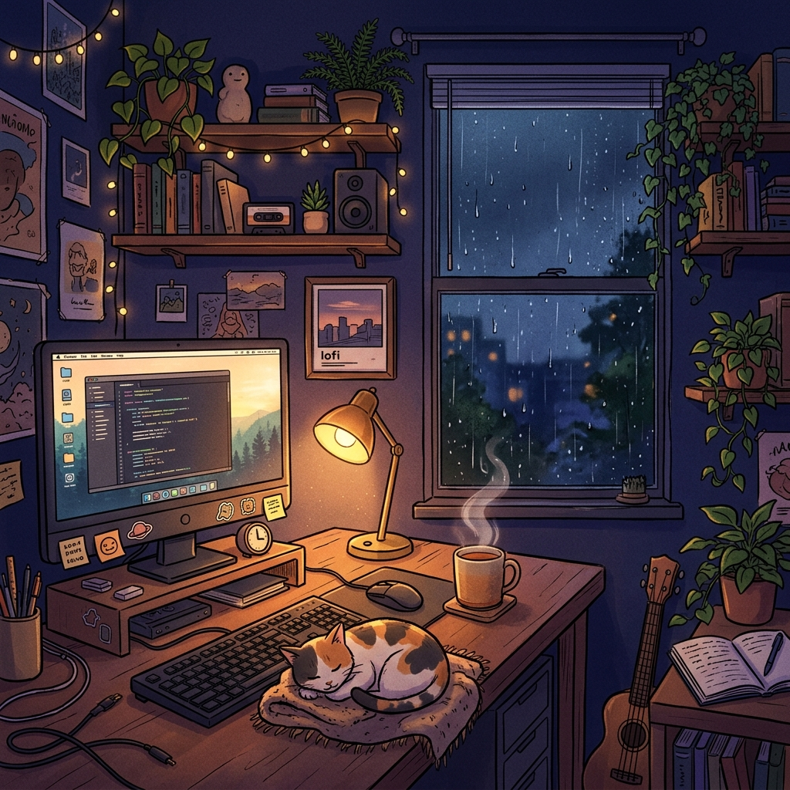

<!-- KANISHMA MANIKANDAN — GitHub Profile README -->

<div align="center">
  
</div>

<br />

<div align="center">
  
</div>

<br/>

<div align="center">
  <a href="https://linkedin.com/in/kanishmamanikandan">
    
  </a>&nbsp;
  <a href="mailto:kanishmamanikandan361@gmail.com">
    
  </a>&nbsp;
  <a href="https://github.com/Kanishma-Manikandan">
    
  </a>&nbsp;
  
</div>

<br/>

---

<table align="right">
  <tr>
    <td align="center">
      <br />
      <sub><b>A.U.R.A Bot</b></sub>
    </td>
    <td>
      <blockquote>
        "Beep boop! 👋 I am <b>AURA</b>, Kanishma's AI assistant.<br/>
        We are building intelligent AI-driven agents, OS-level automated workflows, and modern web applications.<br/>
        Take a look at the projects below or let's collaborate!" ⚡
      </blockquote>
    </td>
  </tr>
</table>

## 🧠 About Me

I am a Computer Science Engineering student passionate about developing AI-powered agents, automated workflows, and modern front-end interfaces. I have hands-on experience building systems that bridge AI reasoning with practical user interfaces (using React, Python, and JavaScript), and working with Computer Vision, Natural Language Processing (NLP), and API-driven automations. I thrive in rapid prototyping environments, hackathons, and solving challenging engineering problems.

- 🎓 **B.E. CSE** @ KGISL Institute of Technology `2024–2028`
- 📍 **Location:** India 🇮🇳
- 🤖 Building **AI agents**, NLP pipelines & computer vision systems
- 🦙 Fine-tuning **LLaMA** with **LoRA** for domain-specific tasks
- ⚙️ Designing **agent-based architectures** with OS-level automation
- 🔗 Integrating APIs for real-time intelligent workflows
- 💡 *"Dream it. Code it. Ship it."*

<br clear="right"/>

---

## 🛠️ Tech Stack

### 🚀 Languages & Frameworks
<p align="left">
  
  
  
  
  
  
  
  
</p>

### 🤖 AI, Machine Learning & Automation
<p align="left">
  
  
  
  
  
  
  
  
</p>

### 🔧 Tools, Databases & DevOps
<p align="left">
  
  
  
  
  
  
</p>

---

## 📂 Highlighted Projects

<div align="center">
<table>
<tr>
<td width="50%" valign="top">

### 🌟 ADAE (AI Domain Assistant Environment) & AURA
> **Co-developer / AI Architect | School of Innovation - AIML**
*   Built an AI assistant featuring an avatar UI and intelligent attendance.
*   Enabled NLP command handling with real-time API automation.
*   Architected modular components for scalable AI agent workflows.
*   *Tech Stack:* `Python`, `React`, `AI Agents`, `NLP`, `API Automation`

</td>
<td width="50%" valign="top">

### 💬 SpeakSpace
> **AI-Powered Command Processing System**
*   Extracts medication reminders and health symptoms from natural language.
*   Automated calendar event creation and conditional email notifications.
*   *Tech Stack:* `Python`, `NLP Basics`, `Automation Systems`, `API Integration`

</td>
</tr>
<tr>
<td width="50%" valign="top">

### 🤖 Machine Learning-Based Bargaining Bot
> **Intelligent Negotiation Chatbot**
*   Fine-tuned LLaMA-based language models to hold structured negotiations.
*   Integrated APIs for LLaMA model fine-tuning and stateful dialogue.
*   *Tech Stack:* `Python`, `LLaMA`, `Model Fine-Tuning`, `API Integration`

</td>
<td width="50%" valign="top">

### 🌐 Website Conversion Optimization Tool
> **Full-Stack Auditing & Analytics Platform**
*   Building a full-stack website auditing and analytics platform.
*   Integrating speech-recognition features to enable accessible data inputs.
*   *Tech Stack:* `React`, `HTML/CSS`, `JavaScript`, `Speech Recognition`, `MongoDB`

</td>
</tr>
</table>
</div>

---

## 🌱 Currently Learning

<div align="center">

```
  Multi-Agent Orchestration    ██████████████░░  85%
  LLaMA + LoRA Fine-Tuning     ████████████░░░░  75%
  Async API Pipelines          ██████████████░░  85%
  Real-Time Computer Vision    ████████████░░░░  75%
  Docker & CI/CD               ██████████░░░░░░  65%
```

</div>

---

## 📊 Git Stats & Streaks

<div align="center">
  <table border="0">
    <tr>
      <td>
        
      </td>
      <td>
        
      </td>
    </tr>
    <tr>
      <td colspan="2" align="center">
        <br/>
        
      </td>
    </tr>
  </table>
</div>

### 🏆 GitHub Trophies
<div align="center">
  
</div>

---

## 📈 Contribution Graph

<div align="center">
  
</div>

---

## 🐍 Contribution Snake

<div align="center">
  <picture>
    <source media="(prefers-color-scheme: dark)" srcset="https://raw.githubusercontent.com/Kanishma-Manikandan/Kanishma-Manikandan/snake-output/github-contribution-grid-snake-dark.svg">
    <source media="(prefers-color-scheme: light)" srcset="https://raw.githubusercontent.com/Kanishma-Manikandan/Kanishma-Manikandan/snake-output/github-contribution-grid-snake.svg">
    
  </picture>
</div>

---

<div align="center">


<br/>


<br/>

<table align="center" border="0">
<tr>
<td align="center">

</td>
<td align="center" width="400">


<br/>

[](https://linkedin.com/in/kanishmamanikandan)
&nbsp;
[](mailto:kanishmamanikandan361@gmail.com)
</td>
<td align="center">

</td>
</tr>
</table>

<br/>

*✦ Built with curiosity · Powered by caffeine & lo-fi · Shipped with ❤️ ✦*

<br/>


</div>
